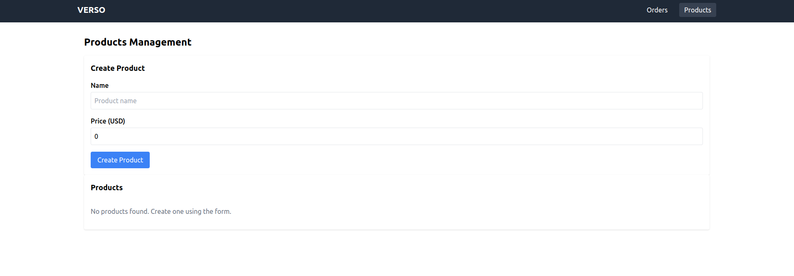
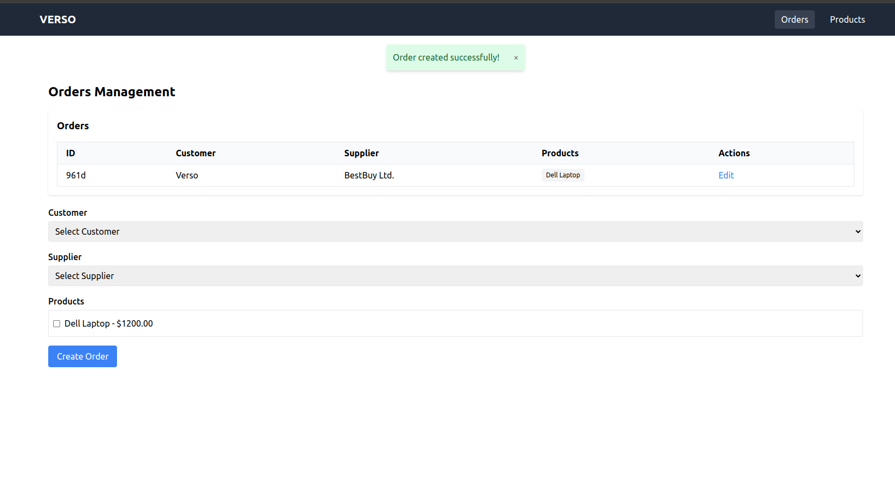

# Case – Frontend Developer (Zohaib)

SaaS platform for companies that offers a REST API that allows to
manage orders and products: A company can create an order with lots of products.
An order has a customer company and a supplier company.
This application allows users to create, edit and delete
orders and products.

---

## ✨ Features

- **Create, update, delete products**
- **Create, update, delete orders**
- **Form validation** with VeeValidate + Zod
- **State management** using Pinia + TanStack Query
- **Routing** with Vue Router
- **Responsive design** with Tailwind CSS
- **Linting & formatting** with ESLint + Prettier
- **Unit tests** with Vitest
- **Mock backend** using JSON Server

---

## 🛠 Tech Stack

| Tool               | Purpose                                   |
| ------------------ | ----------------------------------------- |
| Vue 3 + TypeScript | Frontend framework                        |
| VeeValidate + Zod  | Form validation                           |
| TanStack Query     | Server state (fetching, caching, etc.)    |
| Pinia              | App state (notifications, selected items) |
| Vue Router         | Routing and navigation                    |
| Tailwind CSS       | Utility-first responsive styling          |
| ESLint + Prettier  | Linting and code formatting               |
| Vitest             | Unit testing                              |
| JSON Server        | Mock REST API                             |

---

## 📦 Installation

1. **Clone the repo**

```bash
git clone https://github.com/zohaibshahzadkhan/Verso.git
cd Verso
```

2. **Install dependencies**

```bash
npm install
```

3. **Start JSON Server**

Run this in a separate terminal tab:

```bash
npm run json-server
```

4. **Start the development Server**

Run this in a separate terminal tab:

```bash
npm run dev
```

## 🧪 Testing

Run tests:

```bash
npm run test:unit
```

## Screenshots

### Product Management




### Order Management





### Tests


